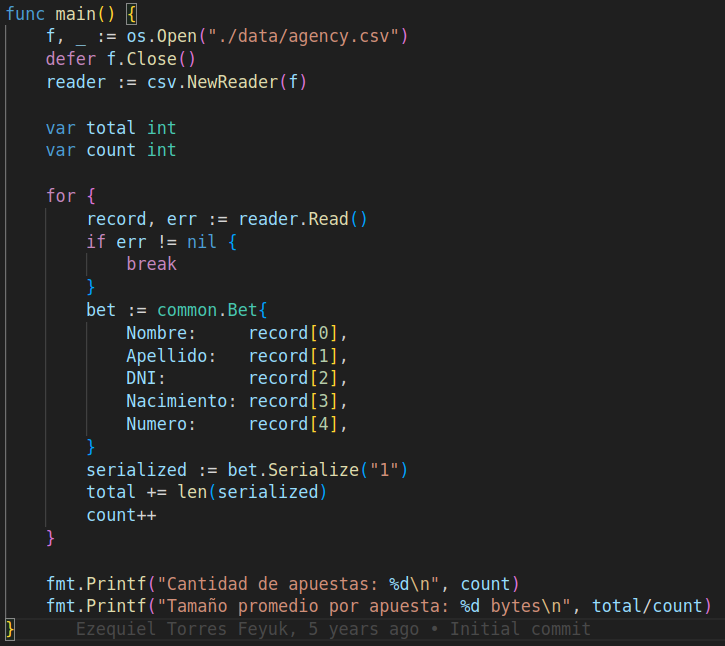

# TP0: Docker + Comunicaciones + Concurrencia

En el presente repositorio se provee un esqueleto básico de cliente/servidor, en donde todas las dependencias del mismo se encuentran encapsuladas en containers. Los alumnos deberán resolver una guía de ejercicios incrementales, teniendo en cuenta las condiciones de entrega descritas al final de este enunciado.

 El cliente (Golang) y el servidor (Python) fueron desarrollados en diferentes lenguajes simplemente para mostrar cómo dos lenguajes de programación pueden convivir en el mismo proyecto con la ayuda de containers, en este caso utilizando [Docker Compose](https://docs.docker.com/compose/).

## Instrucciones de uso
El repositorio cuenta con un **Makefile** que incluye distintos comandos en forma de targets. Los targets se ejecutan mediante la invocación de:  **make \<target\>**. Los target imprescindibles para iniciar y detener el sistema son **docker-compose-up** y **docker-compose-down**, siendo los restantes targets de utilidad para el proceso de depuración.

Los targets disponibles son:

| target  | accion  |
|---|---|
|  `docker-compose-up`  | Inicializa el ambiente de desarrollo. Construye las imágenes del cliente y el servidor, inicializa los recursos a utilizar (volúmenes, redes, etc) e inicia los propios containers. |
| `docker-compose-down`  | Ejecuta `docker-compose stop` para detener los containers asociados al compose y luego  `docker-compose down` para destruir todos los recursos asociados al proyecto que fueron inicializados. Se recomienda ejecutar este comando al finalizar cada ejecución para evitar que el disco de la máquina host se llene de versiones de desarrollo y recursos sin liberar. |
|  `docker-compose-logs` | Permite ver los logs actuales del proyecto. Acompañar con `grep` para lograr ver mensajes de una aplicación específica dentro del compose. |
| `docker-image`  | Construye las imágenes a ser utilizadas tanto en el servidor como en el cliente. Este target es utilizado por **docker-compose-up**, por lo cual se lo puede utilizar para probar nuevos cambios en las imágenes antes de arrancar el proyecto. |
| `build` | Compila la aplicación cliente para ejecución en el _host_ en lugar de en Docker. De este modo la compilación es mucho más veloz, pero requiere contar con todo el entorno de Golang y Python instalados en la máquina _host_. |

### Servidor

Se trata de un "echo server", en donde los mensajes recibidos por el cliente se responden inmediatamente y sin alterar. 

Se ejecutan en bucle las siguientes etapas:

1. Servidor acepta una nueva conexión.
2. Servidor recibe mensaje del cliente y procede a responder el mismo.
3. Servidor desconecta al cliente.
4. Servidor retorna al paso 1.


### Cliente
 se conecta reiteradas veces al servidor y envía mensajes de la siguiente forma:
 
1. Cliente se conecta al servidor.
2. Cliente genera mensaje incremental.
3. Cliente envía mensaje al servidor y espera mensaje de respuesta.
4. Servidor responde al mensaje.
5. Servidor desconecta al cliente.
6. Cliente verifica si aún debe enviar un mensaje y si es así, vuelve al paso 2.

### Ejemplo

Al ejecutar el comando `make docker-compose-up`  y luego  `make docker-compose-logs`, se observan los siguientes logs:

```
client1  | 2024-08-21 22:11:15 INFO     action: config | result: success | client_id: 1 | server_address: server:12345 | loop_amount: 5 | loop_period: 5s | log_level: DEBUG
client1  | 2024-08-21 22:11:15 INFO     action: receive_message | result: success | client_id: 1 | msg: [CLIENT 1] Message N°1
server   | 2024-08-21 22:11:14 DEBUG    action: config | result: success | port: 12345 | listen_backlog: 5 | logging_level: DEBUG
server   | 2024-08-21 22:11:14 INFO     action: accept_connections | result: in_progress
server   | 2024-08-21 22:11:15 INFO     action: accept_connections | result: success | ip: 172.25.125.3
server   | 2024-08-21 22:11:15 INFO     action: receive_message | result: success | ip: 172.25.125.3 | msg: [CLIENT 1] Message N°1
server   | 2024-08-21 22:11:15 INFO     action: accept_connections | result: in_progress
server   | 2024-08-21 22:11:20 INFO     action: accept_connections | result: success | ip: 172.25.125.3
server   | 2024-08-21 22:11:20 INFO     action: receive_message | result: success | ip: 172.25.125.3 | msg: [CLIENT 1] Message N°2
server   | 2024-08-21 22:11:20 INFO     action: accept_connections | result: in_progress
client1  | 2024-08-21 22:11:20 INFO     action: receive_message | result: success | client_id: 1 | msg: [CLIENT 1] Message N°2
server   | 2024-08-21 22:11:25 INFO     action: accept_connections | result: success | ip: 172.25.125.3
server   | 2024-08-21 22:11:25 INFO     action: receive_message | result: success | ip: 172.25.125.3 | msg: [CLIENT 1] Message N°3
client1  | 2024-08-21 22:11:25 INFO     action: receive_message | result: success | client_id: 1 | msg: [CLIENT 1] Message N°3
server   | 2024-08-21 22:11:25 INFO     action: accept_connections | result: in_progress
server   | 2024-08-21 22:11:30 INFO     action: accept_connections | result: success | ip: 172.25.125.3
server   | 2024-08-21 22:11:30 INFO     action: receive_message | result: success | ip: 172.25.125.3 | msg: [CLIENT 1] Message N°4
server   | 2024-08-21 22:11:30 INFO     action: accept_connections | result: in_progress
client1  | 2024-08-21 22:11:30 INFO     action: receive_message | result: success | client_id: 1 | msg: [CLIENT 1] Message N°4
server   | 2024-08-21 22:11:35 INFO     action: accept_connections | result: success | ip: 172.25.125.3
server   | 2024-08-21 22:11:35 INFO     action: receive_message | result: success | ip: 172.25.125.3 | msg: [CLIENT 1] Message N°5
client1  | 2024-08-21 22:11:35 INFO     action: receive_message | result: success | client_id: 1 | msg: [CLIENT 1] Message N°5
server   | 2024-08-21 22:11:35 INFO     action: accept_connections | result: in_progress
client1  | 2024-08-21 22:11:40 INFO     action: loop_finished | result: success | client_id: 1
client1 exited with code 0
```


## Parte 1: Introducción a Docker
En esta primera parte del trabajo práctico se plantean una serie de ejercicios que sirven para introducir las herramientas básicas de Docker que se utilizarán a lo largo de la materia. El entendimiento de las mismas será crucial para el desarrollo de los próximos TPs.

### Ejercicio N°1:
Definir un script de bash `generar-compose.sh` que permita crear una definición de Docker Compose con una cantidad configurable de clientes.  El nombre de los containers deberá seguir el formato propuesto: client1, client2, client3, etc. 

El script deberá ubicarse en la raíz del proyecto y recibirá por parámetro el nombre del archivo de salida y la cantidad de clientes esperados:

`./generar-compose.sh docker-compose-dev.yaml 5`

Considerar que en el contenido del script pueden invocar un subscript de Go o Python:

```
#!/bin/bash
echo "Nombre del archivo de salida: $1"
echo "Cantidad de clientes: $2"
python3 mi-generador.py $1 $2
```

En el archivo de Docker Compose de salida se pueden definir volúmenes, variables de entorno y redes con libertad, pero recordar actualizar este script cuando se modifiquen tales definiciones en los sucesivos ejercicios.

### Ejercicio N°2:
Modificar el cliente y el servidor para lograr que realizar cambios en el archivo de configuración no requiera reconstruír las imágenes de Docker para que los mismos sean efectivos. La configuración a través del archivo correspondiente (`config.ini` y `config.yaml`, dependiendo de la aplicación) debe ser inyectada en el container y persistida por fuera de la imagen (hint: `docker volumes`).


### Ejercicio N°3:
Crear un script de bash `validar-echo-server.sh` que permita verificar el correcto funcionamiento del servidor utilizando el comando `netcat` para interactuar con el mismo. Dado que el servidor es un echo server, se debe enviar un mensaje al servidor y esperar recibir el mismo mensaje enviado.

En caso de que la validación sea exitosa imprimir: `action: test_echo_server | result: success`, de lo contrario imprimir:`action: test_echo_server | result: fail`.

El script deberá ubicarse en la raíz del proyecto. Netcat no debe ser instalado en la máquina _host_ y no se pueden exponer puertos del servidor para realizar la comunicación (hint: `docker network`). `


### Ejercicio N°4:
Modificar servidor y cliente para que ambos sistemas terminen de forma _graceful_ al recibir la signal SIGTERM. Terminar la aplicación de forma _graceful_ implica que todos los _file descriptors_ (entre los que se encuentran archivos, sockets, threads y procesos) deben cerrarse correctamente antes que el thread de la aplicación principal muera. Loguear mensajes en el cierre de cada recurso (hint: Verificar que hace el flag `-t` utilizado en el comando `docker compose down`).

## Parte 2: Repaso de Comunicaciones

Las secciones de repaso del trabajo práctico plantean un caso de uso denominado **Lotería Nacional**. Para la resolución de las mismas deberá utilizarse como base el código fuente provisto en la primera parte, con las modificaciones agregadas en el ejercicio 4.

### Ejercicio N°5:
Modificar la lógica de negocio tanto de los clientes como del servidor para nuestro nuevo caso de uso.

#### Cliente
Emulará a una _agencia de quiniela_ que participa del proyecto. Existen 5 agencias. Deberán recibir como variables de entorno los campos que representan la apuesta de una persona: nombre, apellido, DNI, nacimiento, numero apostado (en adelante 'número'). Ej.: `NOMBRE=Santiago Lionel`, `APELLIDO=Lorca`, `DOCUMENTO=30904465`, `NACIMIENTO=1999-03-17` y `NUMERO=7574` respectivamente.

Los campos deben enviarse al servidor para dejar registro de la apuesta. Al recibir la confirmación del servidor se debe imprimir por log: `action: apuesta_enviada | result: success | dni: ${DNI} | numero: ${NUMERO}`.


#### Servidor
Emulará a la _central de Lotería Nacional_. Deberá recibir los campos de la cada apuesta desde los clientes y almacenar la información mediante la función `store_bet(...)` para control futuro de ganadores. La función `store_bet(...)` es provista por la cátedra y no podrá ser modificada por el alumno.
Al persistir se debe imprimir por log: `action: apuesta_almacenada | result: success | dni: ${DNI} | numero: ${NUMERO}`.

#### Comunicación:
Se deberá implementar un módulo de comunicación entre el cliente y el servidor donde se maneje el envío y la recepción de los paquetes, el cual se espera que contemple:
* Definición de un protocolo para el envío de los mensajes.
* Serialización de los datos.
* Correcta separación de responsabilidades entre modelo de dominio y capa de comunicación.
* Correcto empleo de sockets, incluyendo manejo de errores y evitando los fenómenos conocidos como [_short read y short write_](https://cs61.seas.harvard.edu/site/2018/FileDescriptors/).


### Ejercicio N°6:
Modificar los clientes para que envíen varias apuestas a la vez (modalidad conocida como procesamiento por _chunks_ o _batchs_). 
Los _batchs_ permiten que el cliente registre varias apuestas en una misma consulta, acortando tiempos de transmisión y procesamiento.

La información de cada agencia será simulada por la ingesta de su archivo numerado correspondiente, provisto por la cátedra dentro de `.data/datasets.zip`.
Los archivos deberán ser inyectados en los containers correspondientes y persistido por fuera de la imagen (hint: `docker volumes`), manteniendo la convencion de que el cliente N utilizara el archivo de apuestas `.data/agency-{N}.csv` .

En el servidor, si todas las apuestas del *batch* fueron procesadas correctamente, imprimir por log: `action: apuesta_recibida | result: success | cantidad: ${CANTIDAD_DE_APUESTAS}`. En caso de detectar un error con alguna de las apuestas, debe responder con un código de error a elección e imprimir: `action: apuesta_recibida | result: fail | cantidad: ${CANTIDAD_DE_APUESTAS}`.

La cantidad máxima de apuestas dentro de cada _batch_ debe ser configurable desde config.yaml. Respetar la clave `batch: maxAmount`, pero modificar el valor por defecto de modo tal que los paquetes no excedan los 8kB. 

Por su parte, el servidor deberá responder con éxito solamente si todas las apuestas del _batch_ fueron procesadas correctamente.

### Ejercicio N°7:

Modificar los clientes para que notifiquen al servidor al finalizar con el envío de todas las apuestas y así proceder con el sorteo.
Inmediatamente después de la notificacion, los clientes consultarán la lista de ganadores del sorteo correspondientes a su agencia.
Una vez el cliente obtenga los resultados, deberá imprimir por log: `action: consulta_ganadores | result: success | cant_ganadores: ${CANT}`.

El servidor deberá esperar la notificación de las 5 agencias para considerar que se realizó el sorteo e imprimir por log: `action: sorteo | result: success`.
Luego de este evento, podrá verificar cada apuesta con las funciones `load_bets(...)` y `has_won(...)` y retornar los DNI de los ganadores de la agencia en cuestión. Antes del sorteo no se podrán responder consultas por la lista de ganadores con información parcial.

Las funciones `load_bets(...)` y `has_won(...)` son provistas por la cátedra y no podrán ser modificadas por el alumno.

No es correcto realizar un broadcast de todos los ganadores hacia todas las agencias, se espera que se informen los DNIs ganadores que correspondan a cada una de ellas.

## Parte 3: Repaso de Concurrencia
En este ejercicio es importante considerar los mecanismos de sincronización a utilizar para el correcto funcionamiento de la persistencia.

### Ejercicio N°8:

Modificar el servidor para que permita aceptar conexiones y procesar mensajes en paralelo. En caso de que el alumno implemente el servidor en Python utilizando _multithreading_,  deberán tenerse en cuenta las [limitaciones propias del lenguaje](https://wiki.python.org/moin/GlobalInterpreterLock).

## Condiciones de Entrega
Se espera que los alumnos realicen un _fork_ del presente repositorio para el desarrollo de los ejercicios y que aprovechen el esqueleto provisto tanto (o tan poco) como consideren necesario.

Cada ejercicio deberá resolverse en una rama independiente con nombres siguiendo el formato `ej${Nro de ejercicio}`. Se permite agregar commits en cualquier órden, así como crear una rama a partir de otra, pero al momento de la entrega deberán existir 8 ramas llamadas: ej1, ej2, ..., ej7, ej8.
 (hint: verificar listado de ramas y últimos commits con `git ls-remote`)

Se espera que se redacte una sección del README en donde se indique cómo ejecutar cada ejercicio y se detallen los aspectos más importantes de la solución provista, como ser el protocolo de comunicación implementado (Parte 2) y los mecanismos de sincronización utilizados (Parte 3).

Se proveen [pruebas automáticas](https://github.com/7574-sistemas-distribuidos/tp0-tests) de caja negra. Se exige que la resolución de los ejercicios pase tales pruebas, o en su defecto que las discrepancias sean justificadas y discutidas con los docentes antes del día de la entrega. El incumplimiento de las pruebas es condición de desaprobación, pero su cumplimiento no es suficiente para la aprobación. Respetar las entradas de log planteadas en los ejercicios, pues son las que se chequean en cada uno de los tests.

La corrección personal tendrá en cuenta la calidad del código entregado y casos de error posibles, se manifiesten o no durante la ejecución del trabajo práctico. Se pide a los alumnos leer atentamente y **tener en cuenta** los criterios de corrección informados  [en el campus](https://campusgrado.fi.uba.ar/mod/page/view.php?id=73393).

## Resolución
A continuación se detalla la forma de ejecución y explicación de cada ejercicio en particular.

### Ej1
El primer paso es darle permisos de ejecución al script de bash que permite crear una definición de DockerCompose con una cantidad configurable de clientes:
```bash
chmod +x generar-compose.sh  
```
Este script se encuentra en la en la raíz del proyecto y recibirá por parámetro el nombre del archivo de salida y la cantidad de clientes esperados:
```bash
./generar-compose.sh <nombre_archivo.yaml> <num_clientes>
```

Este script invoca un subscript de python:
```bash
#!/bin/bash
echo "Nombre del archivo de salida: $1"
echo "Cantidad de clientes: $2"
python3 docker-compose-generator.py $1 $2
```

El script de python `docker-compose-generator.py` es finalmente quien genera el .yaml deseado

Para correr el script de bash y crear una definición de DockerCompose ejecutar:
```bash
./generar-compose.sh docker-compose-dev.yaml 5
```


### Ej2
En este punto se modificó la configuración para inyectar los archivos de configuración desde fuera de los contenedores usando volúmenes de Docker. Los volúmenes permiten que un archivo en tu host sea montado dentro del contenedor, lo que facilita la modificación de archivos como los de configuración sin tener que hacer un nuevo build de las imágenes.

Eliminé la linea del Dockerfile del cliente que hace la copia del config.yaml
```Dockerfile
# COPY ./client/config.yaml /config.yaml
```
Modifiqué el generador de docker-compose-dev.yaml agregando volúmenes para inyectar los archivos de configuración desde el host dentro de los contenedores.
```yaml
volumes:
    - ./server/config.ini:/config.ini
```
```yaml
volumes:
    - ./client/config.yaml:/config.yaml
```

Por último eliminé la variable de entorno de `LOGGING_LEVEL` y `CLI_LOG_LEVEL` del docker compose para evitar que sobrescriban los valores de los archivos de configuración.

De este modo los cambios realizados en los archivos config.yaml y config.ini en el host se reflejarán automáticamente dentro de los contenedores sin necesidad de volver a construir las imágenes. La forma de ejecución sigue siendo la misma.

### Ej3
En este punto se crea un script validar-echo-server.sh que valida el funcionamiento del EchoServer utilizando netcat desde un contenedor Docker en la misma network que el servidor.

El script crea un contenedor temporal basado en busybox, que incluye algunas utilidades básicas de Unix, entre ellas sh (shell), y nc (netcat), y se usa el comando netcat (nc) para enviar el mensaje al servidor. 
Finalmente se compara la respuesta recibida con el mensaje enviado. Si coinciden, se imprime
```bash
 "action: test_echo_server | result: success"
 ```
 de lo contrario
 ```bash
 "action: test_echo_server | result: fail"
```

Para ejecutar el script:
1) Le damos permisos de ejecución aL script
```bash
chmod +x validar-echo-server.sh  
```
2) Se inicializa el ambiente de desarrollo
```bash
make docker-compose-up
```
3) Ejecutamos el script para validar el funcionamiento del echo server
```bash
./validar-echo-server.sh
```
4) Detener los containers y destruir todos los recursos asociados al proyecto que fueron inicializados.
```bash
make docker-compose-down
```

### Ej4

En este ejercicio se implementó un manejo graceful de finalización para los contenedores de cliente y servidor. El objetivo fue que, ante una señal de `SIGTERM`, ambos servicios puedan finalizar de forma ordenada, liberar recursos y registrar un mensaje de salida sin errores.

#### Servidor
Se incorporó el manejo de la señal `SIGTERM` utilizando el módulo `signal`. Al recibir la señal, el servidor:
- Cierra el socket de escucha
- Interrumpe el bucle principal de aceptación de conexiones
- Emite un log con el siguiente formato:
```python
logging.info("action: receive_signal | result: success | container: server | signal: SIGTERM")
```
- Finaliza con un mensaje:
```python
logging.info("action: exit | result: success | source: server")
```

Además, se evitó que el cierre del socket genere un error confuso (`Bad file descriptor`) mediante el chequeo del código de error y el estado de terminación.

#### Cliente
El cliente fue modificado para capturar `SIGTERM` usando `os/signal` y `context`. Se introdujo un `context.WithCancel()` que permite salir del bucle principal de envío de mensajes. Al recibir la señal, el cliente:
- Emite un log estructurado:
```go
log.Println("action: receive_signal | result: success | container: client1 | signal: SIGTERM")
```
- Finaliza el loop y escribe:
```go
log.Println("action: exit | result: success | source: client1")
```

Por último, aumenté a 3 segundos el tiempo de espera antes de matar forzosamente un contenedor. Para esto modifiqué en el Makefile el flag -t, ya que si el tiempo de espera es muy corto, puede que el proceso no alcance a hacer el "shutdown limpio".

### Ej5

Considerando que en los próximos ejercicios se requerirá el envío de múltiples apuestas y otro tipo de mensajes, se diseñó desde el inicio un **protocolo de comunicación simple, binario y extensible** que permita adaptarse sin modificar la estructura fundamental del sistema.

---

### Protocolo de comunicación

El protocolo implementado define un formato mixto (binario + texto plano), pensado para:
- Detectar y manejar short-read/short-write
- Identificar mensajes
- Separar la semántica (tipo) del contenido (payload)
- Facilitar la trazabilidad entre mensajes y sus respuestas

---

#### Estructura del mensaje

```
[4 bytes - longitud total]
[2 bytes - tipo de mensaje]
[16 bytes - ID del mensaje]
[payload en texto plano estilo JSON]
```

---

#### Detalle de cada campo

- **Longitud total (4 bytes)**: entero sin signo (big-endian). Indica el largo total del mensaje **desde el campo "tipo" hasta el final del payload** (excluye estos 4 bytes).
- **Tipo de mensaje (2 bytes)**:
  - `1` → Apuesta individual
  - `2` → ACK (respuesta a una apuesta)
  - `3, 4, ...` → (reservado para chunks u otros mensajes futuros)
- **ID del mensaje (16 bytes)**: identificador único generado por el cliente, calculado como el **hash MD5 del payload**. Se utiliza para correlacionar respuestas del servidor (ACK) con el mensaje original a modo de uuid.
- **Payload**: texto plano con formato estilo JSON (sin comillas, sin claves anidadas). Ejemplos:

  Apuesta:
  ```
  {agency:1,nombre:Santiago,apellido:Lorca,dni:30904465,nacimiento:1999-03-17,numero:7574}
  ```

  ACK:
  ```
  {result:success}
  ```

---

### Short Read y Short Write

#### Cliente

- **Short Read**: al leer datos del socket, se utiliza la función `readExactly(...)`, que hace `Read()` en bucle hasta recibir la cantidad exacta de bytes. Esto evita que un mensaje parcial se interprete como completo.
  
- **Short Write**: se implementó la función `writeExactly(...)`, que garantiza que todo el mensaje se escriba completamente al socket, sin depender de que `Write()` lo haga en una sola llamada.

#### Servidor

- **Short Read**: se implementó `recv_all(...)`, una función equivalente que hace `recv()` en bucle hasta completar los N bytes requeridos (headers + payload).
  
- **Short Write**: en el servidor se utiliza `sendall()`, que internamente maneja la escritura completa de datos sobre sockets en Python. Esto garantiza que los ACKs se envíen enteros, sin cortes.

---

### Decisiones de implementación relevantes

- **Uso de `net.Conn.Write(...)` en lugar de `fmt.Fprintf(...)`**:  
  Aunque `fmt.Fprintf()` puede ser útil para logs o comandos tipo texto, el cliente necesita enviar **mensajes binarios estructurados** (con campos como `uint32`, `uint16`, `[]byte`...), por lo que `Write()` es más adecuado, seguro y controlado.

- **Separación de responsabilidades**:
  - `main.go` se encarga de configurar y orquestar el cliente
  - `client.go` encapsula la lógica de comunicación
  - `utils.go` define la estructura `Bet` y puede expandirse para manejar otros tipos de mensaje

- **Logging estructurado y trazable**:
  Se implementaron logs del tipo:
  - `apuesta_enviada | result: in_progress`
  - `receive_ack | result: success | payload: ...`
  - `apuesta_enviada | result: success/fail | id: ...`

  Esto permite seguir fácilmente cada mensaje a lo largo del sistema.

- **Design for extension**:
  El protocolo fue pensado desde el principio para admitir:
  - Envío de chunks de apuestas
  - Nuevos tipos de mensajes
  - ACKs individuales o agrupados
  - Metadata adicional sin romper compatibilidad (ej: cuando me di cuenta que necesitaba enviar el agency, simplemente agregué ese campo al payload de la apuesta sin tener que hacer modificaciones mayores...)


### Ej6

Para mejorar la eficiencia en la transmisión y procesamiento de múltiples apuestas, se implementó el envío de **batches** desde el cliente al servidor. Esta estrategia permite reducir la cantidad de conexiones y ACKs necesarios al agrupar varias apuestas en un solo mensaje TCP.

### Protocolo de comunicación extendido

Se incorporó un nuevo tipo de mensaje al protocolo:

- **Tipo `3`** → Batch de apuestas: agrupa varias apuestas separadas por `"|"` en un único mensaje.

#### Ejemplo de payload

```
{agency:1,nombre:Santiago,apellido:Lorca,dni:30904465,nacimiento:1999-03-17,numero:2201}|{agency:1,nombre:Agustin,apellido:Zambrano,dni:21689196,nacimiento:2000-05-10,numero:9325}|...
```

El resto del formato del mensaje se mantiene:

```
[4 bytes] longitud total (sin incluir este campo)
[2 bytes] tipo (3)
[16 bytes] ID del mensaje (MD5 del payload)
[N bytes] payload (apuestas concatenadas)
```

### Batch configurable y límite de tamaño

1. Se creó un script que recorre los archivos `.csv` de apuestas por agencia, y mide el tamaño promedio del payload serializado de una apuesta utilizando el método `Bet.Serialize(...)`:

    

2. Resultados obtenidos:

   | Cliente | Cantidad de apuestas | Tamaño promedio |
   |---------|----------------------|------------------|
   | client1 | 26936                | 93 bytes         |
   | client2 | 25518                | 93 bytes         |
   | client3 | 16014                | 93 bytes         |
   | client4 |  9238                | 93 bytes         |
   | client5 |   991                | 93 bytes         |

   ➤ **Tamaño promedio por apuesta (serializada): 93 bytes**

3. Además, por cada apuesta agregada en un batch, se suma 1 byte adicional debido al separador `"|"`.

   > Total por apuesta ≈ **94 bytes**

4. El protocolo define un overhead fijo de **18 bytes** en el header (2 de tipo + 16 de ID).  
   Entonces, el payload no debe superar:

   ```
   8192 (máximo mensaje) - 18 (header) = 8174 bytes
   ```

5. Estimación:

   ```
   n * 94 - 1 <= 8174
   n <= (8175 / 94) ≈ 86.96
   ```

   ✔ Resultado seguro: **`batch.maxAmount = 86`**

### Cambios en el cliente (Go)

- Se eliminó la lógica de apuestas individuales.
- Se agregó lectura incremental del archivo `/data/agency.csv` con `encoding/csv`.
- Se arman batches de hasta `batch.maxAmount` apuestas.
- Se envía un mensaje tipo `3`, se espera un único ACK, y se registran logs detallados.

### Cambios en el servidor (Python)

- Se agregó el manejo de mensajes tipo `3`.
- Se parsea el payload separando apuestas por `"|"`, utilizando la misma lógica de `parse_payload_string`.
- Si todas las apuestas del batch son válidas, se persisten con `store_bets(...)` y se responde un ACK con payload `{result:success}`.
- Si alguna apuesta es inválida (falla parseo, etc.), se responde `{result:failure}` y no se guarda nada.

### Logging agregado

#### Cliente:
```
action: batch_enviado | result: in_progress | id: ...
action: batch_enviado | result: success | id: ... | cantidad: N
action: receive_ack | result: success | id: ... | payload: {result:success}
```

#### Servidor:
```
action: receive_message | result: success | msg: ...
action: apuesta_recibida | result: success | cantidad: N
action: send_ack | result: success | id: ... | msg: {result:success}
```


### Ej7

En este ejercicio se agregó soporte para realizar el sorteo una vez que **todas las agencias notificaron que finalizaron el envío de apuestas**, y permitir que cada una consulte **solo sus propios ganadores**. Se mantuvo el diseño cliente-servidor secuencial, sin introducir concurrencia, pero adaptando el protocolo y la lógica para soportar este flujo de sincronización distribuida.

### Extensión del protocolo

Se incorporaron tres nuevos tipos de mensaje:

| Tipo | Descripción                                  |
|------|----------------------------------------------|
| `4`  | Notificación de finalización de envío        |
| `5`  | Consulta de ganadores por agencia            |
| `6`  | Respuesta del servidor con los ganadores     |

#### Ejemplo de payloads

- Mensaje tipo `4` (notificación):
  ```
  {agency:2}
  ```

- Mensaje tipo `5` (consulta de ganadores):
  ```
  {agency:2}
  ```

- Respuesta tipo `6` (ganadores disponibles):
  ```
  {ganadores:30904465|40222111}
  ```

- Respuesta tipo `6` (sorteo no realizado aún):
  ```
  {result:in_progress}
  ```

### Decisiones de diseño importantes

- **Coordinación distribuida a través de notificaciones**:  
  El servidor lleva un registro de las agencias que notificaron finalización (tipo 4). Una vez alcanzado el umbral (`N=3` o `N=5`), se realiza el sorteo utilizando `load_bets(...)` y `has_won(...)`.

- **Polling implementado en el cliente**:  
  Luego de notificar con un mensaje tipo 4, el cliente inicia un bucle de reintentos periódicos (hasta 10 retries, y cada un loop period configurable) enviando tipo 5 (consulta de ganadores). Si el sorteo aún no se realizó, recibe `{result:in_progress}` y espera un período antes de volver a consultar.

- **Sin bloqueo del servidor**:  
  Gracias al uso de conexiones cortas y mensajes independientes (en la fase de polling), el servidor no queda bloqueado permanentemente por una sola agencia. Durante el envío de apuestas, el servidor atiende a un cliente hasta que este termina de mandar todas las apuestas. Luego puede atender a otras conexiones (de polling o de otras agencias), manteniendo una arquitectura simple y compatible con el protocolo ya implementado.

### Flujo general del sistema

1. El cliente envía apuestas en batches (tipo 3).
2. Una vez finalizado el archivo, envía un mensaje tipo 4 notificando que terminó. Hasta este punto se mantiene una única conexión.
3. El servidor guarda la notificación y, si todas las agencias notificaron, ejecuta el sorteo.
4. El cliente realiza polling con mensajes tipo 5 hasta que el servidor responde con tipo 6 que contiene los ganadores. Cada uno de estos mensajes se realiza mediante una nueva conexión.
5. Cuando los ganadores están disponibles, el cliente imprime la cantidad y finaliza su ejecución.

### Cambios en el servidor (Python)

- Se agregó el manejo del mensaje tipo 4. Se almacena la agencia como "notificada" y se responde con un ACK (`{result:success}`).
- Si la cantidad de agencias notificadas alcanza el umbral configurado, se ejecuta el sorteo y se almacenan los ganadores por agencia.
- Se agregó el manejo del mensaje tipo 5. Si el sorteo aún no se realizó, se responde `{result:in_progress}`. Caso contrario, se responde con los DNIs ganadores correspondientes a la agencia solicitante.

### Cambios en el cliente (Go)

- Se agregó `sendFinishedNotification(...)` para enviar tipo 4 y esperar el ACK.
- Se agregó `askForWinners(...)`, que implementa un bucle de polling con reintentos. Si el servidor responde `{result:in_progress}`, se espera y se reintenta.
- Cuando la respuesta contiene ganadores, se registran en el log y el cliente finaliza.

### Logging estructurado agregado

#### Cliente:
```
action: notify_finished | result: success | id: ...
action: consulta_ganadores | result: in_progress | intento: N/10
action: consulta_ganadores | result: success | cant_ganadores: 3
```

#### Servidor:
```
action: notify_finished | result: success | agency: 2
action: sorteo | result: success
action: consulta_ganadores | result: success | agency: 2
```

### Ej8

En este ejercicio se abordó la incorporación de **concurrencia en el servidor** para permitir la atención de múltiples clientes en paralelo. Hasta el Ejercicio 7, el servidor procesaba las conexiones de forma secuencial, lo que implicaba que un cliente debía esperar a que se completara la atención del anterior, incluso en operaciones independientes como enviar apuestas o consultar ganadores.

El objetivo de este ejercicio fue modificar el servidor para que sea capaz de atender múltiples conexiones simultáneamente, garantizando a la vez la **consistencia de los datos compartidos**, la **ejecución única del sorteo**, y la **compatibilidad con el protocolo ya definido**.

#### Concurrencia en Python y limitaciones del GIL

Python presenta una limitación importante al momento de implementar concurrencia con `threading`: el **Global Interpreter Lock (GIL)**. El GIL impide que múltiples threads ejecuten bytecode de Python al mismo tiempo dentro de un mismo proceso. Por esta razón, se optó por una solución basada en **`multiprocessing`**, que permite crear procesos completamente separados con su propio GIL y espacio de memoria, logrando así el objetivo de atender 
clientes en paralelo.

#### Implementación con `multiprocessing`

##### Conexiones paralelas

El servidor fue modificado para aceptar conexiones de forma concurrente utilizando `multiprocessing.Process(...)`. Por cada conexión aceptada, se lanza un nuevo proceso que atiende el mensaje completo del cliente (apuestas, notificación o consulta) y luego finaliza. Esto permite que múltiples clientes puedan estar conectados y enviando mensajes al mismo tiempo sin bloquearse entre sí.

##### Protecciones de concurrencia

Al trabajar con múltiples procesos que acceden a recursos compartidos, se incorporaron los siguientes mecanismos de sincronización:

- **`multiprocessing.Lock`**: utilizado para proteger las escrituras en el archivo de almacenamiento de apuestas. La función `store_bets(...)` no es segura ante accesos concurrentes, por lo que se encapsuló su uso dentro de un `with self._storefile_lock` para evitar condiciones de carrera.

- **`multiprocessing.Value`**: se utilizaron instancias de `Value` para variables de control (`_should_terminate`, `_notified_agencies_count`, `_lottery_done`) que deben ser accedidas y modificadas de forma atómica entre procesos. Este objeto permite encapsular tipos primitivos (`bool`, `int`, etc.) en memoria compartida de forma segura.

##### Diccionario de resultados compartido entre procesos usando `Manager`

Para mantener la estructura `winners_by_agency`, que guarda los ganadores agrupados por agencia usé un dic de Manager. Esta estructura debe ser accesible desde múltiples procesos:

- Proceso A puede realizar el sorteo y escribir ganadores en la estructura.
- Proceso B puede recibir una consulta de ganadores y leer desde la misma estructura.

Con `multiprocessing.Manager`, se pueden crear **objetos compartidos entre procesos** como `dict`, `list`, etc. Internamente, el `Manager` lanza un **servidor de objetos compartidos** que gestiona el acceso a esos objetos mediante proxies y mecanismos de sincronización.

##### Consistencia del sorteo

Una parte crítica de la lógica es asegurar que el sorteo se ejecute **una sola vez**, incluso si múltiples procesos reciben notificaciones de finalización casi al mismo tiempo. Para esto:

- Se utiliza `self._notified_agencies_count` como contador protegido por `get_lock()` para evitar doble incremento.
- Se verifica la condición `self._notified_agencies_count.value == self._total_agencies` dentro de un bloque protegido.
- La ejecución del sorteo (`_run_lottery()`) también está protegida con un lock sobre `self._lottery_done`, que evita que se vuelva a ejecutar.

Esto garantiza que, sin importar el orden en que lleguen las notificaciones, el sorteo se realizará exactamente una vez, y quedará registrado en la estructura compartida de ganadores.
